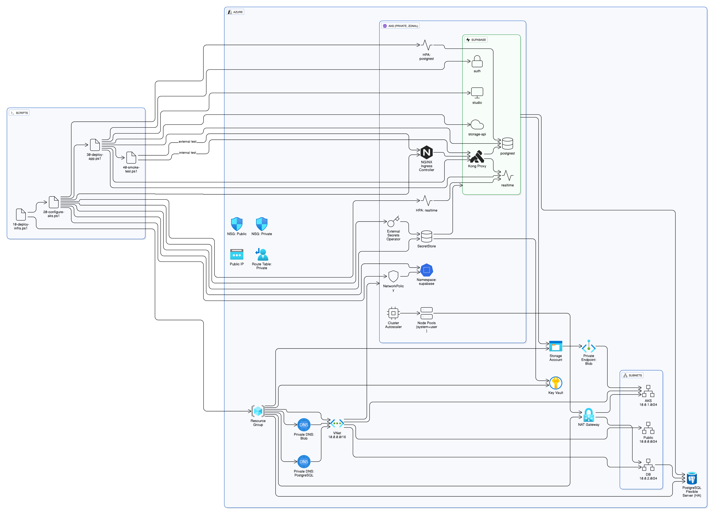
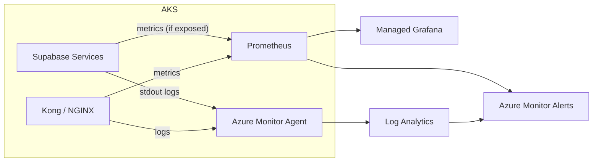

# Architecture Overview

This deployment targets Azure (region: centralus) and provisions a private AKS cluster, Azure Database for PostgreSQL Flexible Server, Azure Key Vault, and Azure Storage (Blob). Kubernetes runs NGINX Ingress, External Secrets Operator (ESO), an S3Proxy backed by Azure Blob, and the Supabase stack installed via Helm.



# Technology Choices Justification

- Azure + AKS (private): Strong managed control plane, easy private networking (system private DNS), and mature enterprise RBAC/identity story. Chosen over AWS for environment familiarity and speed.
- CDK for Terraform (CDKTF, Python): Code-first IaC aligns with the assignment’s “code-based first” requirement. Python provides rich typing and reuse; outputs feed the app layer cleanly.
- External Secrets Operator + Azure Key Vault: Meets the requirement to consume secrets from a cloud vault without embedding in manifests. ESO uses the kubelet managed identity with least-privilege (Key Vault Secrets User) to read secrets.
- S3Proxy backed by Azure Blob: Supabase Storage expects S3 API. S3Proxy gives S3 semantics with Blob durability and avoids running a separate object store.
- NGINX Ingress: Portable and simple enough for this take-home. We note Azure Application Gateway Ingress Controller (AGIC) as a production option, but NGINX demonstrates the Ingress concept clearly.
- Server‑side Helm via `az aks command invoke`: Removes dependence on local kubeconfig for reviewers, avoids remote curl|tar issues in the run‑command container by uploading our packaged chart and values, and produces deterministic installs with full logs.

# Prerequisites & Setup Instructions

- Azure subscription and Azure CLI login
- Python 3.10+, Helm, Node.js (for CDKTF)
- Region: centralus
- Resource names used throughout (created by IaC):
  - Resource Group: `supabase-dev-rg`
  - AKS: `supabase-dev-aks`
  - Key Vault: `supabase-dev-kv`
  - Storage Account: `supabasedevstg`
  - Namespace: `supabase`

Environment variables:

```bash
export ARM_TENANT_ID="your-tenant-id"
export ARM_SUBSCRIPTION_ID="your-subscription-id"
export ARM_CLIENT_ID="your-client-id"
export ARM_CLIENT_SECRET="your-client-secret"
export PG_ADMIN_LOGIN="pgadmin"
export PG_ADMIN_PASSWORD="P@ssw0rd123!"  # use a strong value
# Optional: select a different tfvars file
# export TFVARS_FILE="vars/prod.tfvars"

```

TFVARS: Defaults to `vars/dev.tfvars` if `TFVARS_FILE` is not set. The file includes location=centralus and resource prefixes; no changes required to evaluate this repo.

# Deployment Instructions

1) Provision infrastructure (CDKTF)

```bash
python -m scripts.cli infra-deploy --project-dir infra
```

2) Configure AKS baseline (applies ESO + s3proxy + policies automatically)

```bash
python -m scripts.cli aks-configure --resource-group supabase-dev-rg --cluster-name supabase-dev-aks --namespace supabase
```

3) Sync secrets to Key Vault (seeds defaults; provide external DB creds)

```bash
python -m scripts.cli secrets-sync \
  --key-vault supabase-dev-kv \
  --resource-group supabase-dev-rg \
  --cluster-name supabase-dev-aks \
  --generate-default-secrets
```

Notes:
- Assigns Key Vault Secrets User to the kubelet Managed Identity and creates secrets:
  - `jwt-secret`, `anon-key`, `service-role-key`
  - `postgres-connection-string` (demo; override for Azure PG)
  - `supabase-storage-creds` (JSON keyId/accessKey for S3Proxy)
  - `azure-storage-account-name`, `azure-storage-account-key`
  - `storage-connection-string` (derived from the storage account credentials)
- If you use Azure Database for PostgreSQL (db.enabled=false), you MUST provide:
  - `pg-username`, `pg-password`, `pg-database`
  Provide via `--secrets-file` or set directly in Key Vault before/after running secrets-sync.

4) Deploy Supabase (server‑side Helm, from packaged chart)

```bash
python -m scripts.cli deploy-chart \
  --resource-group supabase-dev-rg \
  --cluster-name supabase-dev-aks \
  --namespace supabase \
  --release supabase \
  --chart-tgz .\charts\supabase-kubernetes\build\supabase-0.1.3.tgz \
  --values-file .\helm\values\supabase-aks-values.yaml
```

# Verification

AKS (private) internal check:

```bash
python -m scripts.cli smoke-test --resource-group supabase-dev-rg --cluster-name supabase-dev-aks --internal
```

Manual checks:

```bash
# Pods
az aks command invoke -g supabase-dev-rg -n supabase-dev-aks --command "kubectl -n supabase get pods"

# ESO status
az aks command invoke -g supabase-dev-rg -n supabase-dev-aks --command "kubectl -n supabase get secretstore,externalsecret -o wide"

# Recent events
az aks command invoke -g supabase-dev-rg -n supabase-dev-aks --command "kubectl -n supabase get events --sort-by=.lastTimestamp | tail -20"

# Rotate a secret (example: JWT)
az keyvault secret set --vault-name supabase-dev-kv --name jwt-secret --value NEW_VALUE
# ESO will resync and update the corresponding K8s Secret automatically
```

External endpoint (optional, if you switch NGINX to external):

```bash
python -m scripts.cli smoke-test --resource-group supabase-dev-rg --cluster-name supabase-dev-aks
```

# Tear-down Instructions

```bash
python -m scripts.cli infra-destroy --project-dir infra
```

This runs `cdktf destroy` and removes all provisioned Azure resources to avoid ongoing costs.

# Secrets Sync Details

- What the CLI seeds with `--generate-default-secrets`:
  - JWT keys, demo Postgres connection string, storage creds, Azure Storage name/key; computes `storage-connection-string` from them.
- What you must provide for external Postgres:
  - `pg-username`, `pg-password`, `pg-database` — the CLI cannot generate these.
- ESO reconciliation timing:
  - Initial fetch typically within 10–60 seconds after secrets exist in Key Vault. Role assignment propagation (Key Vault Secrets User) can take a few minutes; ESO may log 403s during propagation.
- Verify:
  - `az aks command invoke -g <rg> -n <aks> --command "kubectl -n supabase get externalsecret"`
  - `az aks command invoke -g <rg> -n <aks> --command "kubectl -n supabase get secret supabase-env -o yaml || true"`
  - `az aks command invoke -g <rg> -n <aks> --command "kubectl -n supabase get secret supabase-db -o yaml || true"`

# Observability

This deployment outlines a pragmatic observability approach on Azure:

- Metrics: Use Azure Monitor for containers and managed Prometheus to scrape K8s/system metrics. Enable NGINX Ingress metrics and Kong's Prometheus plugin for traffic SLIs (RPS, latency, 5xx). Use container CPU/memory as a baseline for HPAs and add exporters where services expose metrics.
- Logs: Ship stdout/stderr from all pods to Azure Log Analytics via Azure Monitor agent. Optionally use Fluent Bit or Vector for parsing/enrichment and multi-destination forwarding.
- Traces: Where feasible, instrument edge (Kong) and core APIs (REST/Auth) with OpenTelemetry to Application Insights for request-centric debugging.
- Alerts: Define SLO-backed alerts in Azure Monitor (latency p99, 5xx rate, pod readiness failures, CrashLoopBackOff, Azure PG CPU/connections, Blob storage latency). Tie alerts to runbooks.
- Dashboards: Managed Grafana for Prometheus metrics and Kusto-powered panels from Log Analytics. Provide service overviews and dependency dashboards (DB, Storage, Ingress).


# Security & Scalability Deep Dive

- Secrets: Stored in Azure Key Vault; ESO (namespace‑scoped) syncs secrets into Kubernetes using kubelet MI (Key Vault Secrets User) — least‑privilege at data plane. Rotation occurs in Key Vault and ESO reconciles automatically.
- Network: Private AKS (enablePrivateCluster=true), dedicated subnets for AKS/DB, NSGs in IaC, NetworkPolicy applied at namespace to restrict cross‑communication.
- Identity/RBAC: Separation between control‑plane (roleAssignments) and data‑plane (Key Vault secret operations). CLI validates/assigns roles; fallback switch if the caller cannot assign.
- Supply chain: Avoid remote curl|tar in the run‑command container by uploading our packaged chart and values through `az aks command invoke --file` for server‑side Helm.
- Scalability: AKS Cluster Autoscaler configured; HPAs provided for the REST and Realtime components; resource requests/limits in Helm values.

# Challenges & Learnings

- Run‑command shell lacked gzip; bundling and uploading the chart avoids dependency gaps.
- Windows symlink extraction caused tar warnings; packaging via Helm on the local workstation with ZIP fetch (when needed) was more reliable.
- Supabase chart values drift (`rest` vs `postgrest`, `kong.ingress` map vs list) required careful alignment.
- Azure Key Vault has separate control‑plane (roleAssignments) and data‑plane (secret get/set) authorization; both must be satisfied. RBAC propagation can take minutes.
- S3 semantics on Azure Blob via S3Proxy kept the solution Azure-native without operating a separate object store.

- Community Supabase repository did not publish a pullable Helm chart; we built from source and installed server-side via AKS Run Command.
- Private AKS complicates troubleshooting without VNet access; we relied on `az aks command invoke`, which limits interactivity and slows iteration.
- External Secrets synchronization is tricky: role assignment propagation and reconcile timing can delay K8s Secret creation; we documented timing and added mitigations.
- CDKTF was new to this project; initial learning curve, but then straightforward.
- Due to ESO sync timing and the deadline, we could not complete a fully successful smoke test nor validate GitHub Actions end-to-end against the live cluster.

# Future Improvements

- Publish the packaged chart to a container registry as an OCI artifact and install via `helm upgrade --install oci://…`.
- Replace NGINX with AGIC + WAF policy for production ingress and TLS automation.
- Add Azure Monitor/Log Analytics dashboards and structured app logs; wire HPA to custom metrics if needed.
- Use Azure Key Vault CSI driver for file-based secret material where appropriate while keeping ESO for env-style secrets.

- Publish Helm chart to a container registry (OCI) and install via `helm upgrade --install oci://...` with private pulls; pin images and mirror to a container registry for reliability.
- Replace NGINX with AGIC + WAF for production ingress (internal/external split) and managed TLS.
- Observability: enable managed Prometheus/Grafana, Kong Prometheus plugin, and Azure Monitor alert rules; add curated dashboards for core SLIs and dependencies.
- CI connectivity for private AKS: self-hosted GitHub runner or Azure DevOps agent joined to the cluster VNet (or bastion) for richer e2e tests.
- Secrets UX: preflight validation for required Key Vault keys and an optional `--wait-for-eso` sync loop to reduce race conditions.
- GitOps: adopt Flux or Argo CD for continuous reconciliation of Helm and ExternalSecrets from versioned configs.
- Storage options: evaluate native S3-compatible backends or continue with S3Proxy using a pinned, supported image and readiness probes.
- Safer rollouts: blue/green or canary strategies for core services.

