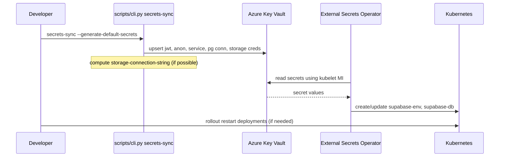

# Secrets Sync Behavior

## Summary

- `secrets-sync` writes secrets to Azure Key Vault; ESO reconciles them into K8s Secrets.
- Defaults are generated for JWT keys and a demo Postgres connection string when `--generate-default-secrets` is used.
- For external Azure Database for PostgreSQL, you must supply `pg-username`, `pg-password`, and `pg-database`.
- `storage-connection-string` is now computed from Azure Storage credentials when available.

## Required Keys

- External DB:
  - `pg-username`, `pg-password`, `pg-database` (required)
- Application:
  - `jwt-secret`, `anon-key`, `service-role-key` (generated if missing)
  - `postgres-connection-string` (generated demo, override for production)
- Storage:
  - `azure-storage-account-name`, `azure-storage-account-key` (provided or auto-detected)
  - `storage-connection-string` (auto-computed)

## Reconciliation & Timing

- ESO typically fetches secrets within 10–60 seconds after they exist in Key Vault.
- Role assignment propagation (kubelet MI -> Key Vault Secrets User) can take a few minutes; transient 403s are expected until it settles.

## Flow (Mermaid)



## Example JSON

```json
{
  "pg-username": "your_user@your-pg-server",
  "pg-password": "<strong_password>",
  "pg-database": "postgres",
  "azure-storage-account-name": "<storageAccount>",
  "azure-storage-account-key": "<storageKey>"
}
```

